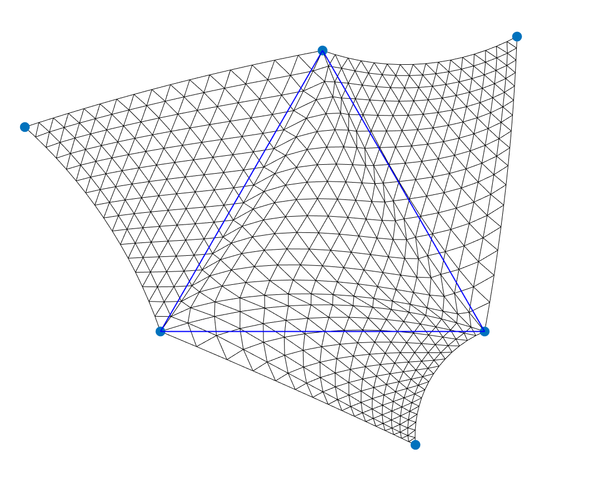

# BPM


MATLAB implementation of 
"BPM: Blended Piecewise Moebius Maps" by 
Shir Rorberg, 
[Amir Vaxman](https://avaxman.github.io/) and 
[Mirela Ben-Chen](https://mirela.net.technion.ac.il/).

[Paper](https://mirelabc.github.io/publications/BPM.pdf), 


If you have any questions or issues running the code, please open an issue or contact shiror@cs.technion.ac.il


## Getting Started

- Clone this repository:
```bash
https://github.com/shirrorbe/BPM.git
```

###  Main BPM parameterization
- Run the ```runme.m``` script in MATLAB


### Input files
- meshname.obj - The input mesh with texture coordinates

### Output files
 - meshname_Mz.off/png - the input source Discrete mesh parameterization
 - meshname_Mw.off/png - the input target Discrete mesh parameterization
 - meshname_Mw_BPM_out - BPM interpolation of the discrete param of the  mesh
 - meshname_Mz_linear_out, meshname_Mw_linear_out - linear interpolation of the discrete param of the  mesh
 - meshname_Mz_proj_out, meshname_Mw_proj_out - projective interpolation of the discrete param of the mesh
 - texture.png - the input texture
 - meshname_Mz2Mw_Mz_QCerr - Quasi-conformal error on top of the spurce mesh
 - meshname_Mz2Mw_Mw_QCerr - Quasi-conformal error on top of the target mesh
 - colorbar.png - the colorbar for the QC error


## Dependencies
 
 Our project was built using the following open source projects:

[gptoolbox](https://github.com/alecjacobson/gptoolbox)

### BPM simulation on a triangle and its 3 neighbors

Simulation of the BPM parameterization on 4 triangles visualized by a subdivision. Flipped triangles are colored in red.

- Run the ```runme_4TriaglesSimulation.m``` script in MATLAB
- To move a point, left click on it and move the cursor. In the right point location press the right bottom.

### Note
- This is a MATLAB implementation and requires MATLAB 2019a or newer 


## Citation

If you find this code useful, please cite our paper:

```
@article{rorberg2023bpm,
  title={BPM: Blended Piecewise Moebius Maps},
  author={Rorberg, Shir and Vaxman, Amir and Ben-Chen, Mirela},
  journal={arXiv preprint arXiv:2306.12792},
  year={2023}
}
```
